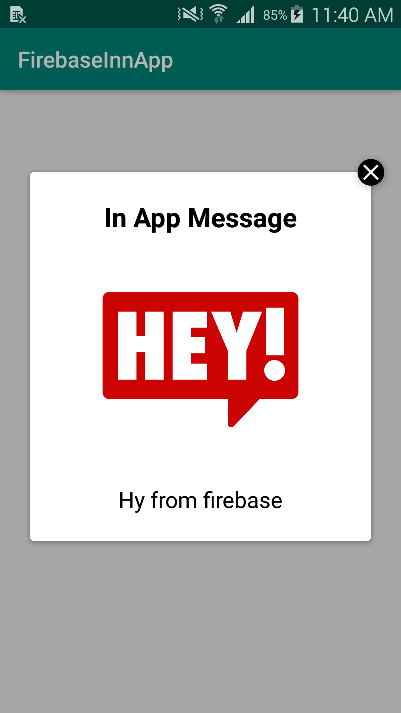
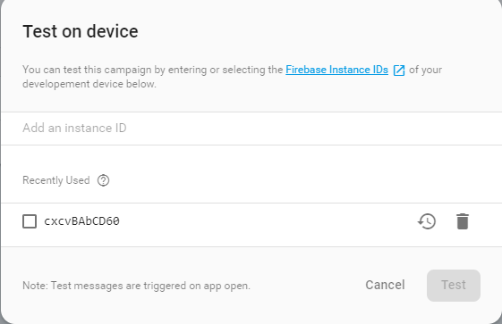

# Firebase In-App Messaging
This is a sample of Firebase In-App Messaging for android.

# Get Started
To get started, your app needs to meet two requirements:
- Enable firebase in your project
- Minimun Android SDK of 16 or higher

## Types of messages

#### Modal

#### Image Only

#### Top Banner

### Dependencies used
Add the In-App Messaging dependency to your app-level build.gradle:

    // Add the In-App Messaging dependency:
    implementation 'com.google.firebase:firebase-inappmessaging-display:17.0.4'

    // Check that your Firebase dependency is up-to-date:
    implementation 'com.google.firebase:firebase-core:16.0.6'

## Integration
1. Get your apps Instanse id from FirebaseInstanceID
        
        //Inside Main Activity
        Log.d("Instance ID ",FirebaseInstanceId.getInstance().getId());
        
2. Now add the instance id in the Firebase Console to test the In-App in your device

        Firebase -> In-App Messaging -> New Capaign -> Test on device
        
      
        
3. After testing you can select the target and timing for the message to show
